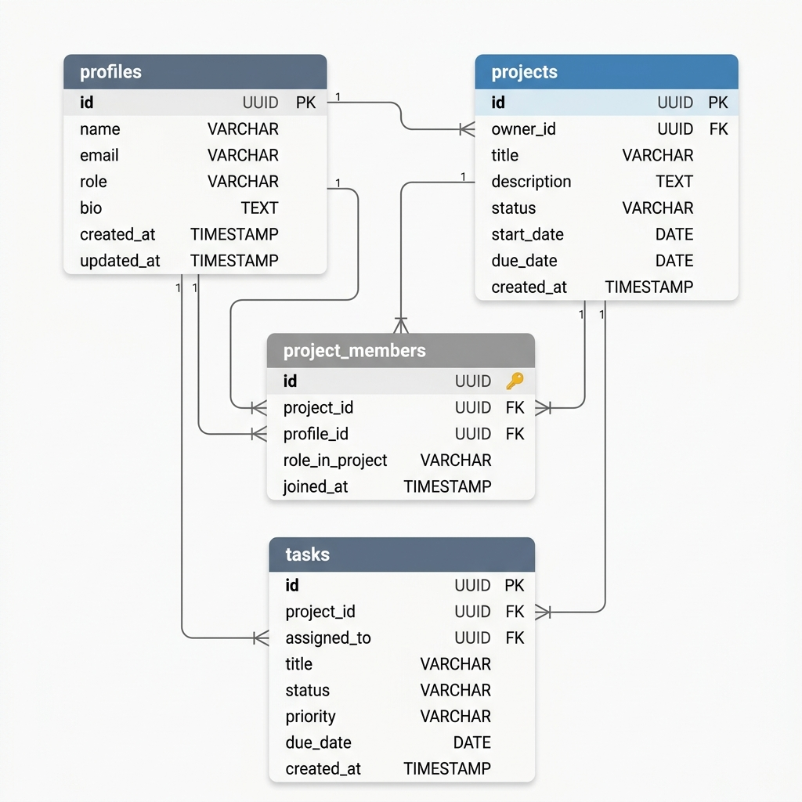

# Lumina Workspace

A production-ready collaborative task management system with real-time collaboration, role-based access, and a modern Apple-inspired UI.

---

## 🔗 Live Application Links

* **Live Demo (Frontend - Vercel):** [https://lumina-workspace.vercel.app](https://YOUR_VERCEL_APP_URL.vercel.app) *(Replace with your actual Vercel deployment URL)*
* **API Service (Backend - Render/Railway):** [https://lumina-backend.onrender.com](https://YOUR_RENDER_BACKEND_URL.onrender.com) *(Replace with your actual Render/Railway URL)*

---

## 📊 Database Schema (ERD)

The database diagram representing relations between `profiles`, `projects`, `project_members`, and `tasks`:




---

## 🛠️ Tech Stack

### Frontend
- **Framework**: React 18 + Vite + TypeScript (Strict Mode)
- **Styling**: Tailwind CSS v3 (Custom HSL theme tokens for Apple look)
- **State Management**: TanStack Query v5 & React Context (Auth)
- **Forms & Validation**: React Hook Form + Zod
- **API Client**: Axios with Token Interceptors
- **Realtime**: Client-side `@supabase/supabase-js` realtime channel listener
- **Icons & Alerts**: Lucide React + React Hot Toast

### Backend
- **Framework**: Node.js 20 LTS + Express 5 + TypeScript
- **Database Client**: `@supabase/supabase-js` Admin SDK (Service Role)
- **Validation**: Zod (Payload validator middleware)
- **Security**: CORS, Helmet, Rate limiting (`express-rate-limit`)

---

## 📂 Project Structure

```
Lumina Workspace/
├── server/                    # Express Backend
│   ├── src/
│   │   ├── config/            # Env and Supabase setup
│   │   ├── controllers/       # Route request handlers
│   │   ├── services/          # Business logic & validations
│   │   ├── repositories/      # Database CRUD layer
│   │   ├── middleware/        # JWT auth, error handlers, rate limiters
│   │   ├── routes/            # Routes endpoints
│   │   ├── validators/        # Zod input validation schemas
│   │   └── types/             # Shared TypeScript structures
│   ├── .env                   # Local Backend configurations
│   ├── package.json
│   └── tsconfig.json
├── src/                       # React Frontend
│   ├── app/                   # App root entry, providers & router tree
│   ├── components/            # Layout shells and shared UI elements
│   ├── constants/             # Caching keys and Route paths
│   ├── context/               # AuthContext session keeper
│   ├── features/              # Feature modules (Auth, Projects, Dashboard, Profile, Tasks)
│   ├── hooks/                 # Custom React hooks (useRealtime, useDebounce)
│   ├── services/              # API connections (Axios and Supabase Realtime)
│   ├── types/                 # Shared data interfaces
│   └── main.tsx
├── .env                       # Local Frontend configurations
├── tailwind.config.js
├── postcss.config.js
└── schema.sql                 # Complete DB migration script
```

---

## 🚀 Setup & Installation

### Step 1: Database Setup (Supabase)
1. Create a new project in your [Supabase Dashboard](https://supabase.com).
2. Open the **SQL Editor** in your Supabase dashboard and run the entire contents of the `schema.sql` file located in the root directory. This creates all tables (`profiles`, `projects`, `project_members`, `tasks`), custom enums, indexes, triggers, Row-Level-Security (RLS) policies, and the `avatars` storage bucket.

### Step 2: Configure Environment Variables

1. **Backend Environment Variables**:
   In the `/server` directory, copy `.env.example` to `.env` and fill in the values:
   ```env
   PORT=3001
   NODE_ENV=development
   SUPABASE_URL=https://your-project.supabase.co
   SUPABASE_SERVICE_ROLE_KEY=your-supabase-service-role-key   # Bypasses RLS (Safe for server use)
   SUPABASE_JWT_SECRET=your-supabase-jwt-secret               # Used to verify user logins
   FRONTEND_URL=http://localhost:5173
   ```

2. **Frontend Environment Variables**:
   In the root directory, create a `.env` file and fill in the values:
   ```env
   VITE_API_URL=http://localhost:3001/api/v1
   VITE_SUPABASE_URL=https://your-project.supabase.co
   VITE_SUPABASE_ANON_KEY=your-supabase-anon-key               # Safe to expose publicly
   ```

### Step 3: Run Backend Server
```bash
cd server
npm install
npm run dev
```
The server will boot on `http://localhost:3001`. You can test health endpoints at `http://localhost:3001/api/v1/health`.

### Step 4: Run Frontend Server
In a new terminal window at the root of the workspace:
```bash
npm install
npm run dev
```
The client dashboard will load on `http://localhost:5173`.

---

## 🔒 Business & Security Architecture

1. **Clean Decoupled Flow**: The React app *never* writes/modifies database states directly via Supabase. All CRUD operations flow through the Express backend, keeping client code safe and maintainable.
2. **Realtime Synchronization**: The client listens directly to Supabase table changes (`INSERT`, `UPDATE`, `DELETE`) for tasks, members, and projects. Upon changes, React Query caches are automatically invalidated, bringing details up-to-date instantly.
3. **Secure Realtime**: Client realtime connects utilizing the user's active session JWT. Supabase applies Row Level Security (RLS) policies to make sure users can *only* subscribe to changes in projects they belong to.
4. **Brute Force Defense**: Login and sign-up requests are limited to `10 requests per 15 minutes` per IP address using `express-rate-limit`. Searches are limited to `60 requests per minute`.
5. **No Orphaned Storage**: Avatar updates perform an inline best-effort deletion of previous avatar images from Supabase storage before uploading the new one.
